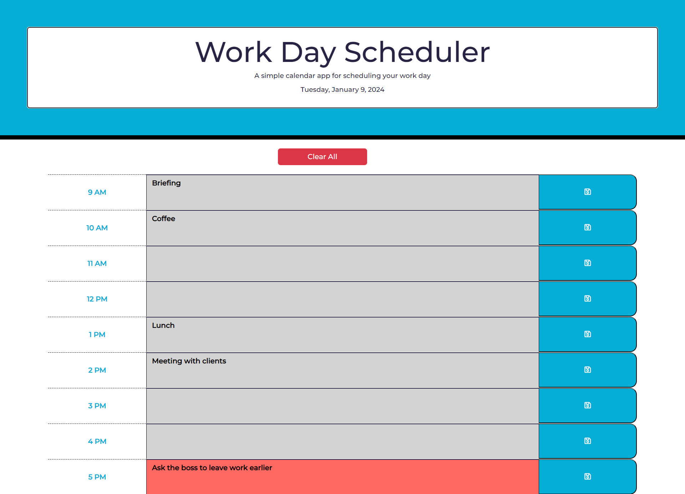

# Work Day Scheduler

## The Repository

This repository is where I code my [Work Day Scheduler](https://github.com/blaztted/work-day-scheduler) project in order to demonstrate my proficiency in JavaScript to potential employers or clients, showcasing my skills as a developer.

## Deployed Site

  

You can find the project deployed [here](https://blaztted.github.io/work-day-scheduler/).

## Links

https://github.com/blaztted/work-day-scheduler

https://blaztted.github.io/work-day-scheduler/

## License

Copyright (c) Microsoft Corporation. All rights reserved.

Licensed under the [MIT](LICENSE.txt) license.
